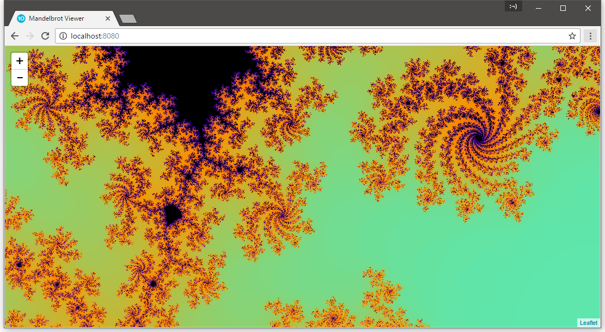

# Mandelbrot Viewer using Orleans

This project allows you to explore the Mandelbrot fractal.

Grains in [Orleans](http://dotnet.github.com/orleans) are used to generate lots of 256x256 PNG images which are served to
a web page. [Leaflet](http://leafletjs.com/) is used to display these tiles to the user.

To run the project, press `F5` and open a browser at [http://localhost:8080](http://localhost:8080).

The code has not been optimised. It was written over my lunch hour :¬)

You can view an example of the project up at running at [http://ramandelbrot.azurewebsites.net/](http://ramandelbrot.azurewebsites.net/).

## License

MIT
